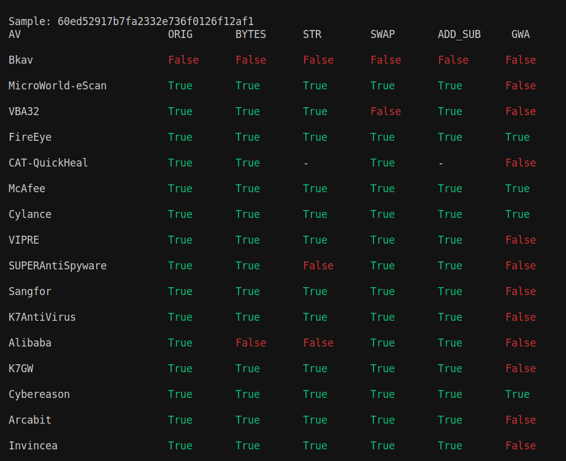

# ABOUT

Series of python scripts that modify malware by adding strings, raw binary data, changing int3 instructions and realocaing returns and submits them to the Virus Total API in order to find flaws in common used antivirus so that they can be enhanced and have a wider range of detection.

The scripts use [Pefile](https://pypi.org/project/pefile/) to identify the malware's sections, in particular the ones with executable code, and feed them to [Capstone](http://www.capstone-engine.org/) so a disassemble can be generated and futurally modified by the functions described in the scripts, wich will generate md5-hashed files that are sent to [Virus total](https://www.virustotal.com/gui/home/upload).


# SUPPORTED MODIFICATIONS
  - append raw binary data
  - append goodware strings
  - change int3 instructions  
  - swap ret instructions with nop instructions


# RUNNING
### Getting a key
  - In order to use the API you must sign up to VirusTotal Community. Once you have a valid VirusTotal Community account you will find your personal API key in your personal settings section
  - For more information, go to the [Virus Total API](https://developers.virustotal.com/reference#getting-started) and follow the steps.
  - After you get the key, assign it to the "key" variable in the "vtapi.py" script 


### To test with the files in this repository:

```
  python3 main.py [Folder for results] malware cmiv2.dll
```

### For more information on how to run it: 

```
  python3 main.py -h
```

# RESULTS
  - False: not a malware
  - True: a malware

 


